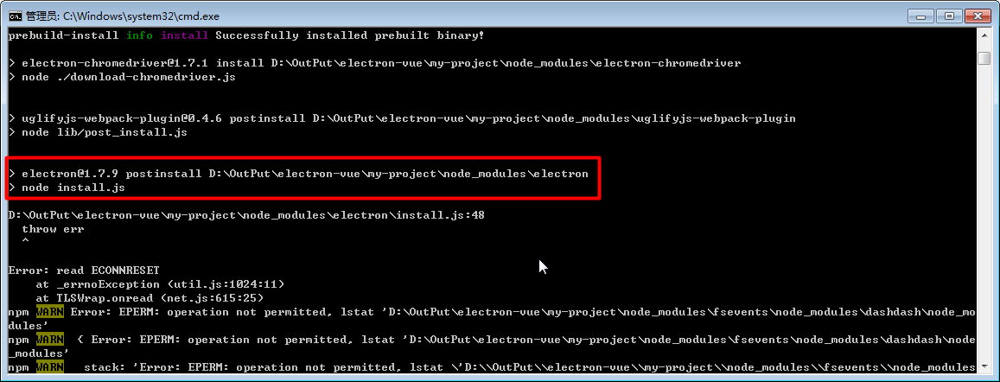
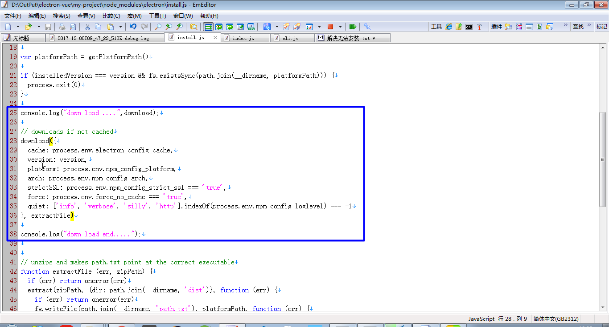
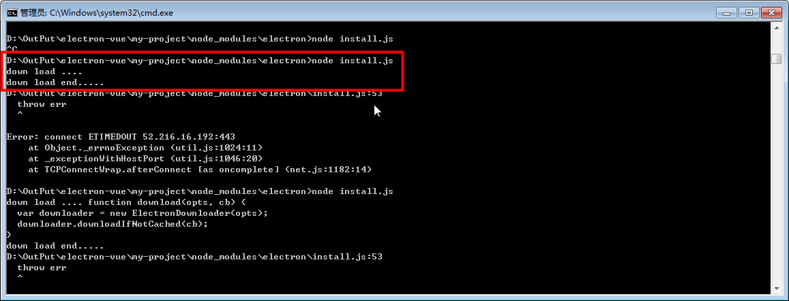
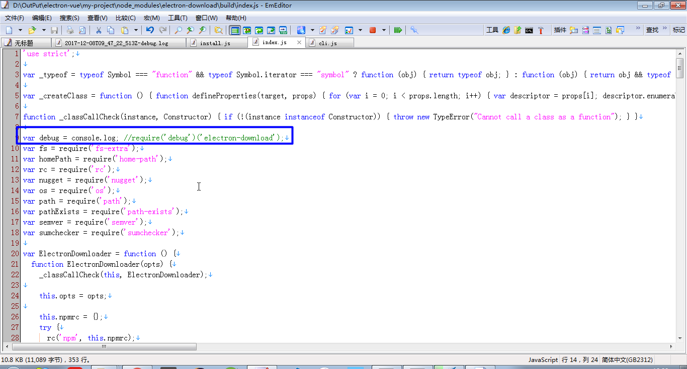
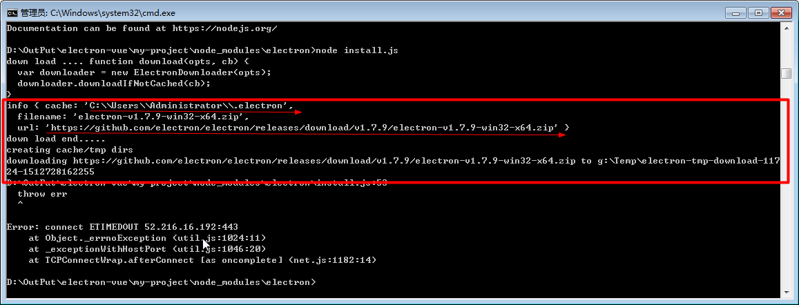
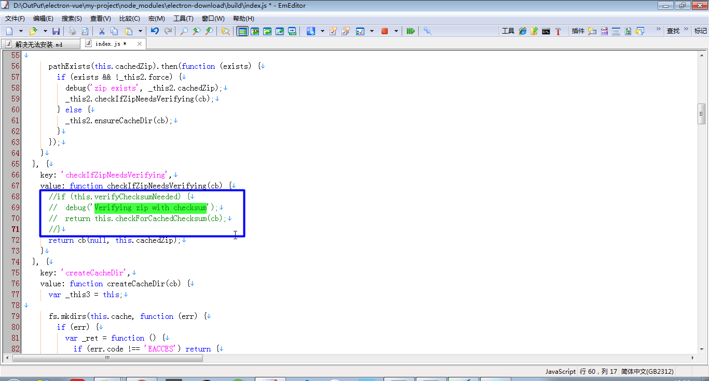
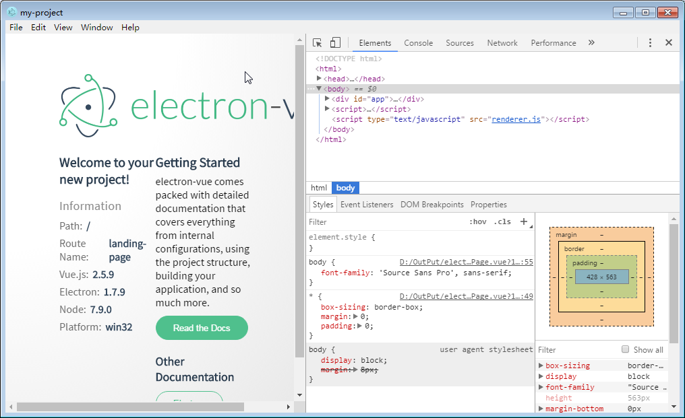
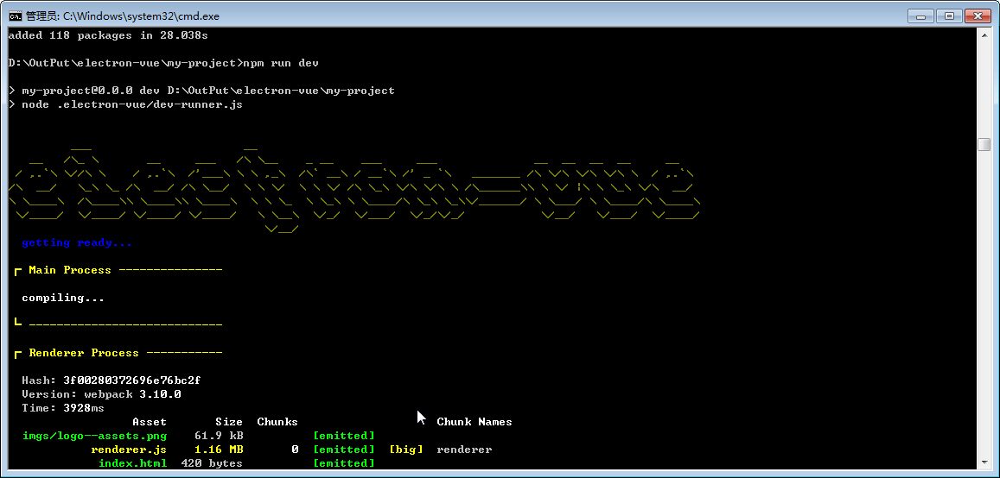

# 解决electron-vue无法安装

npm install 失败，长时间停止在 node install.js



找到该文件，加个日志，发现是下载文件的问题。






再找到下载文件的代码，发现有debug信息，但没有打印出来，直接把debug改掉，改成console.log

这个文件 D:\OutPut\electron-vue\my-project\node_modules\electron-download\build\index.js




再跑一次，




```
info { cache: 'C:\\Users\\Administrator\\.electron',
  filename: 'electron-v1.7.9-win32-x64.zip',
  url: 'https://github.com/electron/electron/releases/download/v1.7.9/electron-v1.7.9-win32-x64.zip' }
```

从日志中可以看出，是下载 `https://github.com/electron/electron/releases/download/v1.7.9/electron-v1.7.9-win32-x64.zip` 到 `C:\\Users\\Administrator\\.electron` 目录。

手工用迅雷下载好该文件放到对应目录，重新执行npm install。

发现居然还有校验下载的文件，直接注释掉



重新执行 npm install。搞定。

运行一下 npm run dev，界面终于出来了。。。不容易啊！




